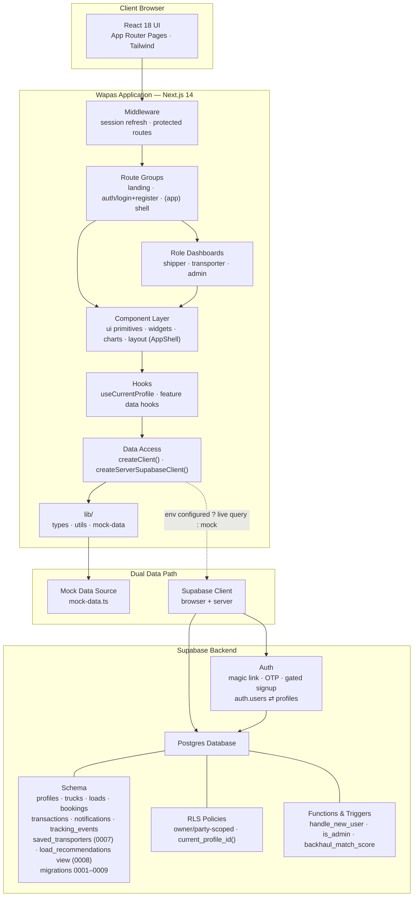

<div align="center">

# Wapas

### Truck Backhaul Marketplace

Matching empty return-leg trucks with ready-to-ship loads — in real time.

[](https://nextjs.org/)
[](https://react.dev/)
[](https://www.typescriptlang.org/)
[](https://tailwindcss.com/)
[](https://supabase.com/)

</div>

---

## Overview

**Wapas** is a demo-ready, production-styled frontend built for investor and stakeholder demos. Every screen ships with realistic mock data, every button navigates somewhere real, and every core flow — auth, posting a load, booking, payment, tracking — works end to end **without a backend running**.

It's a genuine Next.js application, not a static prototype, and is wired to optionally connect to a real Supabase backend for production use.

| | |
|---|---|
| **Live demo** | Quick-login as Transporter, Shipper, or Admin — no setup required |
| **Backend** | Fully optional — runs on mock data, upgrades path-by-path to Supabase |
| **Status** | Demo-ready · Production-styled |

---

## Table of Contents

- [Quick Start](#quick-start)
- [Tech Stack](#tech-stack)
- [System Architecture](#system-architecture)
- [Project Structure](#project-structure)
- [Design System](#design-system)
- [Mock Data & Demo Mode](#mock-data--demo-mode)
- [Supabase Backend](#supabase-backend-optional)
- [Shipper Features](#shipper-features)
- [Responsive & Accessibility](#responsive--accessibility-notes)
- [Known Simplifications](#known-simplifications)

---

## Quick Start

```bash
npm install
npm run dev
```

Open **http://localhost:3000** — no environment variables required. The app runs entirely on the mock data in `src/lib/mock-data.ts`.

On the login page, use the **Quick demo access** buttons (Transporter / Shipper / Admin) to jump straight into the dashboard, or use the OTP flow with any email and the code `123456`.

```bash
npm run build       # production build
npm run start       # run the production build
npm run lint         # eslint
npm run typecheck    # tsc --noEmit
```

---

## Tech Stack

| Layer | Choice |
|---|---|
| **Framework** | Next.js 14 (App Router) + React 18 + TypeScript |
| **Styling** | Tailwind CSS + hand-written shadcn-style primitives (`src/components/ui`) |
| **Animation** | Framer Motion |
| **Charts** | Recharts |
| **Icons** | lucide-react |
| **Forms** | Native controlled inputs — React Hook Form + Zod installed and ready for stricter validation |
| **Toasts** | Sonner |
| **Backend (optional)** | Supabase — Postgres + Auth + RLS (`supabase/`) |

---

## System Architecture



Roles resolve through `useCurrentProfile()` (linked `auth_user_id → profiles`); `middleware.ts` refreshes the session on protected routes; and role dashboards read owner/party-scoped data via RLS. The Supabase clients return `null` when environment variables aren't set, so each data path degrades to the mock source and the demo keeps working throughout the migration.

---


### Why a route group?

`src/app/(app)/` is a Next.js route group — it doesn't affect the URL, it just lets every page under it (`/dashboard`, `/marketplace`, `/wallet`, ...) share the same `layout.tsx`, which renders `<AppShell>` (desktop sidebar + topbar, mobile bottom nav + drawer menu). `/`, `/login`, and `/register` sit outside the group since they use their own layouts (marketing navbar / `AuthShell` split screen).

---

## Design System

All brand tokens live in `tailwind.config.ts` and `src/app/globals.css`.

| Token | Detail |
|---|---|
| **Colors** | `canvas` (#FEFCFA background) · `navy` (#262D53, brand dark navy, full 50–900 scale) · `blue` (#4A7FCE primary) · `aqua` (#69C8D4 accent). Gradients: `bg-wapas-gradient` (blue → aqua), `bg-wapas-gradient-dark` (navy → blue) |
| **Typography** | Plus Jakarta Sans for headings/display (`font-display`) · Inter for body copy (`font-body`), loaded via `next/font/google` |
| **Surfaces** | `.card-surface` — white, rounded-xl3, soft shadow, base for every card. `.glass` — frosted glassmorphism panel |
| **Motion** | Custom Tailwind keyframes: `fade-up`, `scale-in`, `shimmer` (skeleton loading), `route-draw` (SVG route line), `truck-drive`, `pulse-ring` (live-location pulse). Framer Motion handles viewport reveals and page transitions |
| **Signature motif** | The logo's road-and-pin swoosh is echoed as an animated route line connecting two points (hero, marketplace detail, live tracking map), so it reads as a design system rather than a reused icon |

---

## Mock Data & Demo Mode

`src/lib/mock-data.ts` is the single source of truth for demo content: profiles, trucks, loads, bookings, transactions, notifications, route stats, and chart series. Every page imports from here — there is no hidden placeholder or unfinished data path anywhere in the UI.

Forms (login OTP, register, post a load, booking payment) simulate a network request with a short `setTimeout`, show a loading state, then a Sonner toast confirmation and navigate on — making the demo feel like a real, live product without needing a backend running during a pitch.

**To connect real data:** replace the imports from `mock-data.ts` in a page with a Supabase query using `createClient()` (browser) or `createServerSupabaseClient()` (server components), both in `src/lib/supabase/`. They return `null` when Supabase env vars aren't set, so you can migrate one page at a time without breaking the rest of the demo.

**Current real-vs-mock split:**

| Page | Source |
|---|---|
| Shipper dashboard (`/dashboard/shipper`) | **Real** — loads, bookings, transactions, saved transporters via Supabase + RLS |
| Post a load (`/post-load`) | **Real** — INSERT into `loads` + duplicate & budget warnings |
| Marketplace, truck detail, booking, tracking | **Mock** — `src/lib/mock-data.ts` (unchanged) |

Marketplace truck search still filters the mock truck set, but the **shipper-facing features built on top** (advanced filters, truck-type visuals, saved-transporter actions, load management, invoice access) are implemented against the real Supabase schema and keep working in demo mode. See [Shipper Features](#shipper-features).

---

## Supabase Backend (optional)

Full instructions, migration files, and the RLS policies to deploy live in [`docs/SUPABASE.md`](./docs/SUPABASE.md).

```bash
# 1. Create a project at supabase.com, then link it locally
npx supabase login
npx supabase link --project-ref <your-project-ref>

# 2. Push the schema + RLS policies
npx supabase db push

# 3. (Optional) load demo data
npx supabase db execute --file supabase/seed.sql

# 4. Copy .env.example to .env.local and fill in your project URL + anon key
```

---

## Shipper Features

The shipper experience was completed end-to-end (see
[`docs/CHANGELOG_shipper_feature_completeness.md`](./docs/CHANGELOG_shipper_feature_completeness.md) for per-feature files, edge-case handling and manual test steps).

| Feature | Where |
|---|---|
| **Advanced truck filters** — truck type, capacity range, price range, availability date, transporter rating minimum, plus a "Reset filters" control | `filter-bar.tsx` (collapsible "More filters" panel) + `marketplace/page.tsx` |
| **Truck/container type visuals** — local, bundled SVG silhouette per type (no external API), shown on cards, detail and booking review | `truck-type-icon.tsx` + `lib/truck-types.ts` |
| **Saved transporters** — real heart save/unsave on truck cards & the transporter view, plus a live list + unsave on the dashboard | `save-transporter-button.tsx` → `saved_transporters` table (RLS-scoped) |
| **Load management** — edit (date/budget) or cancel an open load from the dashboard, RLS-scoped to the shipper's own rows | `dashboard/shipper/page.tsx` |
| **Invoice access** — delivered bookings link to the tracking page's "Download invoice" button (reused, not duplicated) | `dashboard/shipper/page.tsx` |

**Edge cases surfaced as features, not silent failures:**

- **Zero truck matches** → actionable empty state with a **"Clear all filters"** CTA.
- **Pickup date passed on an open load** → amber **"Needs attention"** banner, per-load "Pickup passed" badge, and a stat card — edit date or cancel from there.
- **Near-duplicate load** (same route/date/weight) → inline notice + confirmation before submit; posting still allowed.
- **Budget well below typical price-per-ton × weight** → soft inline warning; never blocks posting.
- **Cancelling a load/booking with a transporter attached** → confirmation step, then `status = 'cancelled'` (never a hard delete).

**No schema migration was needed for any of the above** — `saved_transporters` already existed (migration 0007), so migrations 0001–0009 and all RLS policies are untouched.

---

## Responsive & Accessibility Notes

- Mobile-first at 320–414px, verified breakpoints at 768 / 1024 / 1440, and ultra-wide via `max-w-[1400px]` containers.
- Bottom navigation + floating "Post" action button on mobile; collapses into a left sidebar + topbar on `lg:` (1024px+).
- All interactive elements use visible focus rings (`:focus-visible` in `globals.css`), semantic buttons/links, and `aria-label` / `aria-expanded` where appropriate (menus, accordions, switches).
- `prefers-reduced-motion` is respected globally — animations collapse to near-instant for users who request it.

---

## Known Simplifications

| Area | Current state | Production path |
|---|---|---|
| **Auth** | Mocked — OTP accepts any 6 digits, demo-role buttons sign in instantly | Wire up real Supabase Auth (or another provider) |
| **Payments** | Mocked — booking flow always succeeds | Swap in a real gateway (Razorpay/Stripe) behind the same UI |
| **Maps** | Stylized SVG, not a live embed — keeps the demo API-key-free | `TrackingMap` (`src/components/tracking/map-placeholder.tsx`) is isolated for a drop-in real map SDK |
| **AI match scores** | Illustrative — `backhaul_match_score()` in `0002_functions_triggers.sql` shows the intended formula | Replace with a trained model |

---

<div align="center">

Made with ❤️ by **Team DevX**

</div>